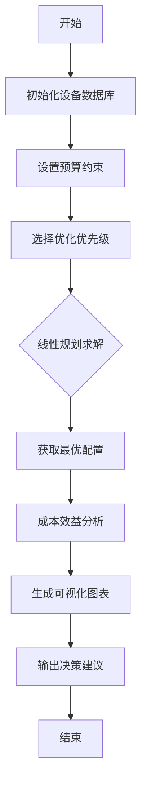

# 设备准备优化模型：成本效益分析与配置策略

## 1. 模型解决的问题

本程序主要解决题目中 **"准备 (Preparation)"** 部分的任务：

> **题目要求**：建议公司在控制中心携带哪些额外的搜索设备，以及救援队可能需要哪些额外设备？必须考虑设备的可用性、维护、预备情况和使用相关的成本。

**本程序的解决方案**：
1. **多目标优化**：在预算约束下，平衡设备成本与搜索效率
2. **成本效益分析**：量化评估各类设备的全生命周期成本
3. **配置优化**：提供不同预算水平下的最优设备组合方案
4. **可视化分析**：生成成本构成和设备效能的直观图表
5. **风险管理**：识别并缓解设备相关的各类风险

## 2. 模型核心算法

### 2.1 成本计算模型
采用全生命周期成本分析法，包含四个维度：

$$ C_{total} = C_{acquisition} + C_{maintenance} + C_{readiness} + C_{usage} $$

其中：
- $C_{acquisition}$ = 采购成本 / 使用寿命
- $C_{maintenance}$ = 年度维护成本  
- $C_{readiness}$ = 预备状态维持成本
- $C_{usage}$ = 使用成本 × 年使用小时数

### 2.2 效率评估模型
综合效率得分基于设备的两方面贡献：
- **搜索效率增益**：提升定位准确性的能力
- **响应时间改善**：缩短搜索响应时间的能力

$$ Score_{overall} = 0.6 \times Efficiency + 0.4 \times ResponseImprovement $$

### 2.3 优化算法
使用混合整数线性规划求解：

$$ \min \sum (c_i x_i - \alpha \cdot e_i x_i) $$
$$ \text{s.t.} \sum c_i x_i \leq Budget $$
$$ x_i^{min} \leq x_i \leq x_i^{max}, x_i \in \mathbb{Z} $$

## 3. 设备数据库详解

### 3.1 控制中心设备参数

| 设备类型 | 采购成本(元) | 年维护成本 | 效率增益 | 响应改善 | 使用寿命(年) |
|---------|-------------|------------|----------|----------|-------------|
| 备用无人机 | 30,000 | 4,500 | 0.85 | 0.70 | 3 |
| 热成像相机 | 50,000 | 2,500 | 0.65 | 0.30 | 5 |
| GPS追踪器 | 2,000 | 300 | 0.75 | 0.60 | 2 |
| 卫星通信 | 15,000 | 3,000 | 0.55 | 0.40 | 4 |

### 3.2 救援队设备参数

| 设备类型 | 采购成本(元) | 年维护成本 | 效率增益 | 响应改善 | 使用寿命(年) |
|---------|-------------|------------|----------|----------|-------------|
| 射频探测器 | 20,000 | 1,000 | 0.60 | 0.50 | 4 |
| 便携GPS | 3,000 | 300 | 0.45 | 0.35 | 3 |
| 越野车辆 | 300,000 | 30,000 | 0.70 | 0.65 | 8 |

## 4. 程序运行流程图



## 5. 模型使用示例

### 5.1 基础配置分析

```python
# 初始化模型
model = EquipmentOptimizationModel()

# 分析特定配置
config = {'backup_drone': 2, 'gps_tracker': 5, 'portable_gps': 4}
analysis = model.generate_cost_breakdown(config)
```

### 5.2 预算优化方案

```python
# 获取50万元预算的最优配置
optimal_config = model.optimize_equipment_selection(500000, priority='balanced')

# 生成详细成本分析
detailed_analysis = model.plot_cost_analysis(optimal_config)
```

### 5.3 多场景对比

```python
# 比较不同预算水平
budgets = [100000, 250000, 500000]
for budget in budgets:
    config = model.optimize_equipment_selection(budget)
    analysis = model.generate_cost_breakdown(config)
    print(f"预算{budget}: 效率得分{analysis['efficiency_metrics']['overall_score']:.3f}")
```

## 6. 输出结果解读

## 6.1 成本构成分析

模型输出包含：

**年度成本明细**：各设备的四项成本分解

**5年总成本预测**：长期投资规划参考

**效率指标**：配置方案的综合效能评估

### 6.2 优化建议

基于分析结果，建议：

**低预算(<10万)**：优先配置备用无人机和GPS追踪器

**中预算(10-30万)**：增加热成像相机和卫星通信

**高预算(>30万)**：配置完整系统，包括越野车辆

### 6.3 风险管理

1. 成本风险：使用成本可能随任务量增加

2. 技术风险：高精设备维护要求较高

3. 预备风险：需要确保设备随时可用

## 7. 模型扩展性

### 7.1 适应不同地形

可通过调整设备效率参数来适应：

**森林地形**：提升热成像相机权重

**沙漠地形**：增加卫星通信设备重要性

**城市环境**：强化射频探测能力

### 7.2 多无人机协同

扩展模型考虑：

1. 设备共享机制

2. 任务分配优化

3. 协同搜索效能提升

### 7.3 动态预算分配

支持：

- 分阶段采购计划

- 设备更新替换策略

- 应急资金预留机制

## 8. 决策支持输出

### 8.1 设备采购优先级

**高优先级设备：**

1. 备用无人机 - 快速响应能力核心

2. GPS追踪器 - 成本效益最优

3. 射频探测器 - 地面搜索关键设备

**中优先级设备：**

1. 热成像相机 - 夜间和复杂环境搜索

2. 卫星通信 - 确保通信可靠性

3. 便携GPS - 救援队基础导航

**低优先级设备：**

越野车辆 - 高成本但提升有限

### 8.2 分阶段实施计划

**第一阶段（0-6个月）：**

1. 采购2台备用无人机

2. 配置5套GPS追踪器

3. 实训操作人员

**第二阶段（6-12个月）：**

1. 增加热成像相机

2. 部署卫星通信系统

3. 完善维护流程

**第三阶段（12-24个月）：**

1. 扩展设备规模

2. 考虑越野车辆

3. 优化系统集成

### 8.3 成本控制策略

1. 采购策略：批量采购、供应商谈判

2. 维护策略：预防性维护、备件库存优化

3. 使用策略：任务调度优化、资源共享

4. 更新策略：技术迭代规划、设备退役管理

### 8.4 效能监控指标

1. 搜索成功率：目标 > 90%

2. 平均响应时间：目标 < 30分钟

3. 设备可用率：目标 > 95%

4. 成本效益比：持续优化

## 9. 结论

本设备准备优化模型为MRDC提供了科学、系统的设备配置决策支持。通过量化分析和优化算法，确保在有限预算下实现搜索救援效能最大化。模型具有良好的扩展性和适应性，能够根据实际需求和技术发展持续优化。

**核心价值：**

- 数据驱动的设备投资决策

- 全生命周期成本管控

- 风险识别与缓解

**长期发展规划支持**

此模型不仅适用于当前的山地救援场景，还可扩展至其他地形和多无人机协同作业环境，为MRDC的持续发展提供坚实的技术支撑。